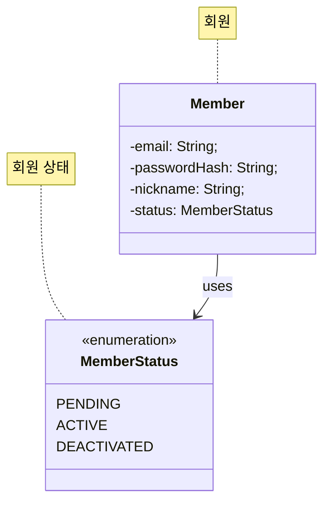

## 회원(Member)
### 행위
- constructure(): 회원 생성: email, nickname, password, status
- 가입을 완료 시킨다.

### 규칙
회원 생성 후 상태는 가입 대기
- 일정조건을 만족하면 가입 완료가 된다.
- 가입 완료 상태에서는 탈퇴할 수 있다.

```mermaid
classDiagram
    
    note for MemberStatus "회원 상태"
    class MemberStatus {
        <<enumeration>>
        PENDING
        ACTIVE
        DEACTIVATED
    }

    note for Member "회원"
    class Member {
        -email: String;
        -passwordHash: String;
        -nickname: String;
        -status: MemberStatus
    }

    Member --> MemberStatus: uses
```
