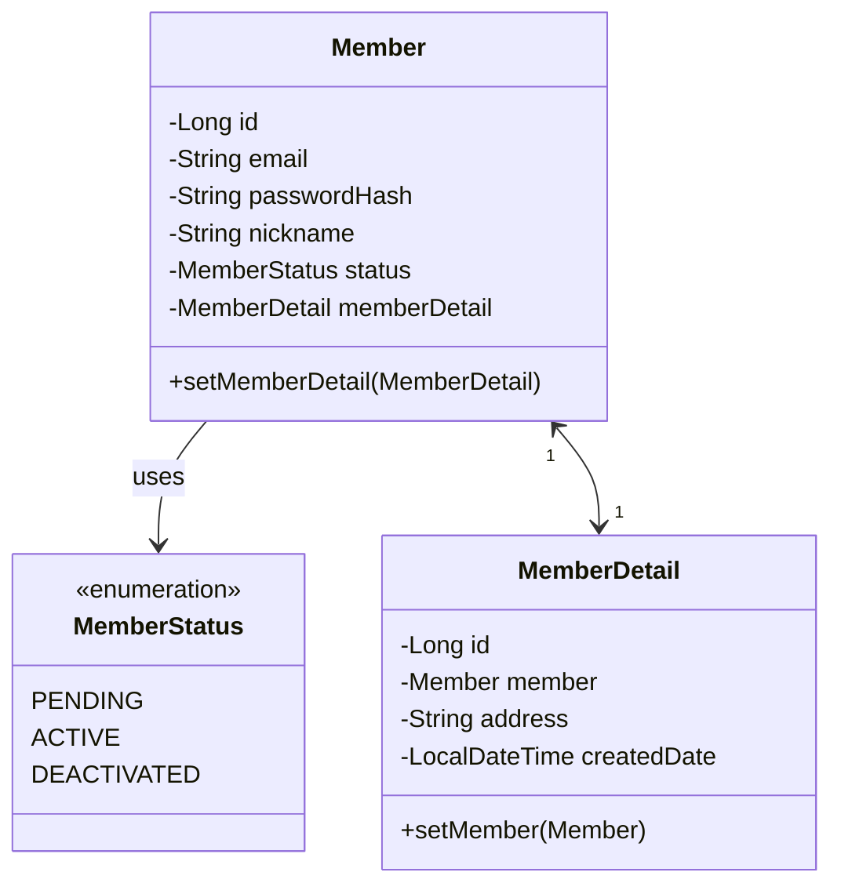

# 회원 애그리거트 (Member Aggregate)

## 회원(Member)
_Aggregate Root_
### 행위
- static builder(): 회원 등록: email, nickname, password, status ;; 나는 builder 쓸꺼임
- activate(): 가입을 완료 시킨다.
- deactivate(): 탈퇴 시킨다.
- verifyPassword(): 비밀번호를 검증한다.

### 규칙
- 회원 생성 후 상태는 가입 대기
- 일정조건을 만족하면 가입 완료가 된다.
- 가입 완료 상태에서는 탈퇴할 수 있다.

## 비밀번호 인코더(PasswordEncoder)
_Domain Service_
- not `@Service`
- domain 이지만, 로직이 들어있어, domain class에 넣기 애매모호한 것들
- ex:) password encoder 

### 행위
- `encode()`: 비밀번호 암호화하기
- `matches()`: 비밀번호 일치 확인

## 회원 상세(MemberDetail)

